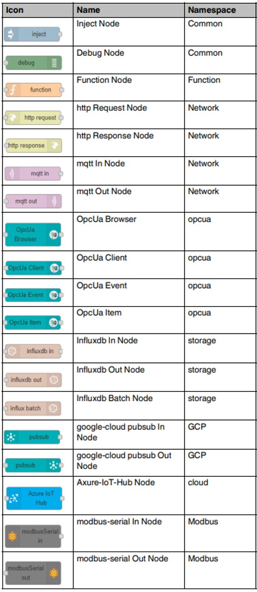
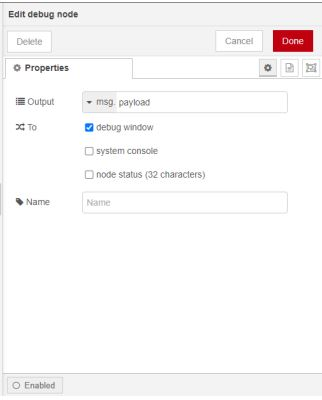
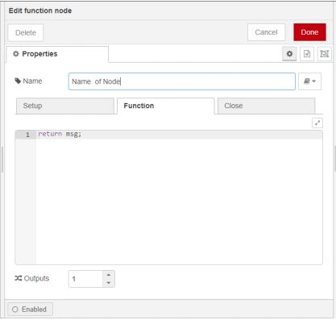
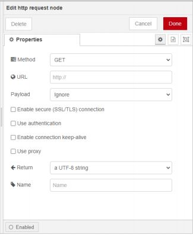
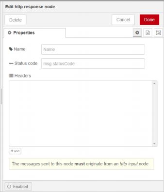
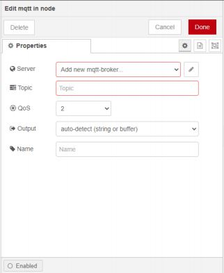
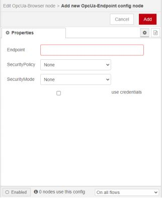
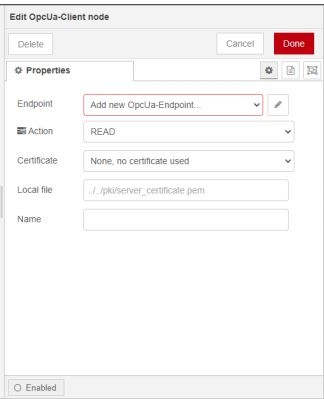
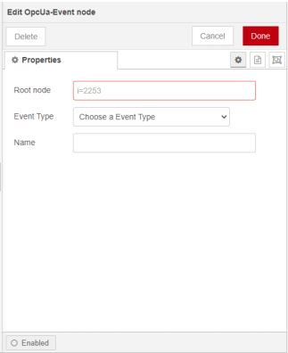
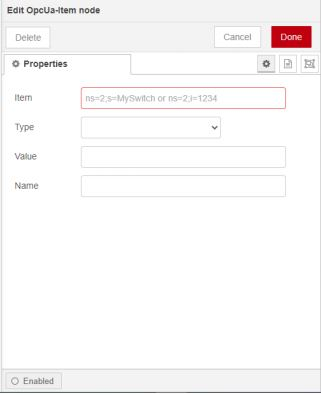

## Quick Reference Guide 
### For
## Phoenix Contact: EPC-1522 and EPC1502
 
### Version: 1.2
---
# Basic Nodes

SourceCode:  
[Common & Function Nodes](SourceCode/Quickstart_Flows/BasicNodes/Common_Function_Nodes.json)   [Sequence Parser Nodes](SourceCode/Quickstart_Flows/BasicNodes/Sequence_Parser_Nodes.json)   [Storage Nodes](SourceCode/Quickstart_Flows/BasicNodes/Storage_Nodes.json)

## Overview 
Node-RED is a programming tool for wiring together hardware devices, APIs and online services. Node-RED provides a browser-based editor that makes it easy to wire together flows 
using the wide range of nodes in the palette that can be deployed to its runtime in a single 
click.
The Node-RED palette includes a default set of nodes that are the basic building blocks for 
creating flows. Few more existing basic nodes will be used. 

- The left-hand side of the screen consists of the nodes a user can drag and drip for creating flows.
- The middle section is the flow window here a user can drag nodes and created flows by 
connecting “wire” between the nodes.
- The right-side of the screen is for debugging, information about nodes, and a help section for each node.

## Basic Nodes
Node-RED has a “node” used in the flow as a logical block in every step.  

## Node Description

### Inject Node
Injects a message into a flow, either manually or at regular intervals. The message payload 
can be a variety of types, including strings, JavaScript objects, or the current time.
The Inject node can initiate a flow with a specific payload value. The default payload is a 
time stamp of the current time in milliseconds since January 1st, 1970. The node also supports injecting strings, numbers, booleans, JavaScript objects, or flow/global context values. 
By default, the node is triggered manually by clicking on its button within the editor. It can 
also be set to inject at regular intervals or according to a schedule. It can also be configured 
to inject once each time the flows are started.
The maximum Interval that can be specified is about 596 hours/24 days. However, if you are 
looking at intervals greater than one day, consider using a scheduler node that can cope 
with power outages and restarts.

  
The edit configuration of inject node includes one output; the output payload includes two 
parameters. 
- payload - The configured payload of the message.
- topic - An optional property that can be configured in the node.

### Debug Node
Displays selected message properties in the “debug” sidebar tab and optionally the runtime 
log. By default, it displays msg.payload, but can be configured to display any property, the 
full message, or the result of a JSON data.
The debug sidebar provides a structured view of the messages it has sent, making it easier 
to understand their structure. JavaScript objects and arrays can be collapsed and expanded as required. Buffer objects can be displayed as raw data or as a string, if possible.  

  
Fields available in the “Edit debug node” window are:
- Output the complete message or output only msg.payload.
- Output the message to a debug window, system console, or node status.
- Name the node.

### Function Node
A JavaScript function to run against the messages being received by the node. 
>User should have basic knowledge of javascript code when working with this node.

The messages are passed in as a JavaScript object called msg. By convention it will have 
a “msg.payload” property containing the body of the message.
The function is expected to return a message object (or multiple message objects), but can 
choose to return nothing to halt a flow.
The “Setup” tab contains code that will be run whenever the node is started. The “Close” tab 
contains code that will be run when the node is stopped.  

  
Available fields in the “Edit function node” window are:
- “Name” field of the node.
- “Setup” tab, which contains JavaScript code that will be run once whenever the node is 
deployed.
- “Function” tab, which contains JavaScript code that is executed every time in the flow.
- “Close” tab, which contains JavaScript code that is executed that will be run when the 
node is being stopped or re-deployed.
- In bottom of window, outputs of the node can be increased. The default is 1

### http request
The HTTP request sends and returns the response. When configured within the node, the 
URL property can contain mustache-style tags. These allow the url to be constructed using 
values of the incoming message. For example, if the url is set to example.com/{{{topic}}}, it 
will have the value of msg.topic automatically inserted. Using {{{...}}} prevents mustache
from escaping characters like /, &, and etc.
The node can optionally automatically encode msg.payload as query string parameters for 
a GET request, in which case msg.payload has to be an object.  

  
The “Edit http request node” window contains the following fields:
- Method: Select the http request method, i.e., GET, POST, PUT, DELETE, HEAD, or the 
one that is being set by msg.method.
- URL: Set the http request URL in this field.
- Payload: Select the appropriate action to be taken with the msg.payload. Available options are: Ignore, append to query string parameter, Send in request body. Select the 
desired option from the drop-down box.
- Return: Select the return type from this field. Options are UTF-8 string, Binary buffer, 
and Parsed JSON object.

### http response
Sends responses back to requests received from an HTTP Input node.  

  
The window contains the following fields:
- Name of the node
- Status code that is to be sent in response.
- Headers: Set the needed headers from this field.  

The statusCode and headers can also be set within the node itself. If a property is set within 
the node, it cannot be overridden by the corresponding message property

### MQTT in Node
Connects to a MQTT broker and subscribes to messages from the specified topic. The subscription topic can include MQTT wild cards, + for one level, # for multiple levels. 
This node requires a connection to a MQTT broker to be configured. Click the “Pencil” icon 
to open the “Edit mqtt in node” window for configuration.
Several MQTT nodes (in or out) can share the same broker connection, if required.

  
Fields in the “Edit mqtt in node” window
- Server configure field.
- Topic: Provide topic that is needed to field triggered.
- QoS: Select 0, 1, or 2 from the QoS drop-down menu. 
- Output like String, Buffer, JSON, etc.
- Name of the node. 

  
Provide the server host and port, along with the client ID of the device. 

### OPC UA Browser
Connect to an endpoint: opc.tcp://host:port/UA/EndpointName. Inject a Timestamp or fill 
topic of msg object to browse. Browsers “Topic” field is to define one browseable OPC UA 
Item address like ns=0;i=85. Payload contains just references of the give OPC UA address.

  

Click the “Pencil” icon to configure the Endpoint 

  
Add an enpoint , for example:
> opc.tcp://127.0.0.1:4840  to connect to internal PLCnext Engineer variables

### OPC UA Client
Connect to an endpoint like opc.tcp://host:port/UA/EndpointName. Inject your OPC UA 
address (NodeId) by the Topic of an Inject node or with the OpcUa-Item controlled by an 
Inject node.
To Read/Write inject the Topic for every operation.
The value to Write should be injected by an OpcUa-Item.
Inject the Topic only once on Subscribe or Event for subscription and you got the changing 
value on every Interval. Every inject subscribes a new monitored item. 

  
Edit window contains following fields:
- Endpoint: Configured in same way as in 3.2.6 section.
- Action: Specify the type of action that needs to be performed. The list of actions available are:
- Read
- Write
- Browse
- Subscribe
- Unsubscribe
- Deletesubscription
- Event
- Info
- Monitor
- Read Multiple
- Certificate: Server certificate options contain None/Local File path.
- Local File: Path of the certificate file.
- Name: Contains name of the node.

### OPC UA Event
Defines OPC UA events that will be subscribed from the server. Server root node is used to 
look at selected events under it. If the Condition type can be left empty, then all alarm/event 
objects will be considered. 

  
The available fields in the “Edit OpcUa-Event node” window are:
- Root Node: Specify root node with node id.
- Event Type: Select event type from the drop-down menu.
- Name: Name of node

## OPC UA Item
Defines OPC UA item, type and value. Item contains valid OPC UA address like 
>ns=2;i=4 OR ns=3;s=MyVariable

There are not all types possible for now, but you can select some. Value is needed only if 
item will be written to OPC UA server. If value isn’t filled, OpcUa-Item sends input payload.

  
The available fields in the “Edit OpcUa-Item Node” window are:
- Item: OpcUa address of item. 
- Type: Select a type of value to insert from the drop-down menu.
- Value: Input the value to be inserted.
- Name: Name of the node.
