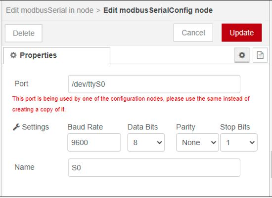
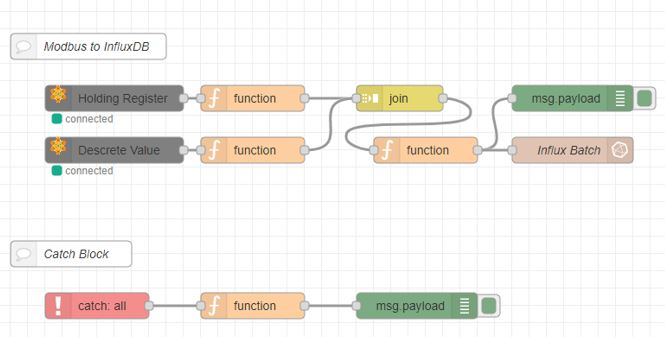
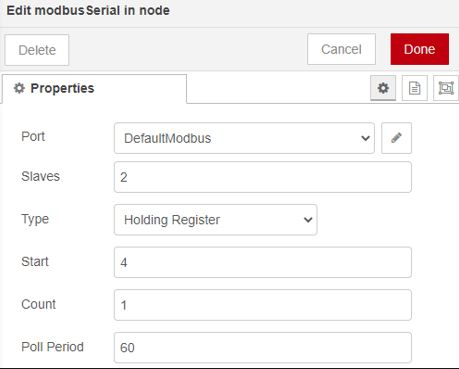

## Quick Reference Guide 
### For
## Phoenix Contact: EPC 1522 and EPC 1502
 
### Version: 1.2
---
# Modbus Serial to InfluxDB

SourceCode: [Read data from Modbus Slave](SourceCode/Quickstart_Flows/QuickGuideFlows/Modbus_To_InfluxDB.json)

>Note: Please note while importing the Modbus flows use only configuration of own port otherwise it will show the PortNotOpen error for duplicate configurations of same port. Although this is being maintained while editing the Modbus Serial node

  
This is the flow for taking values form Modbus Slaves and insert those values into InfluxDB. Below is the flow that is going to be used for explaining the said workflow.

  

### Configurations and Steps
There are two Modbus serial in nodes used, one for reading values of holding register. Other one for reading discrete input values. 
Configure the Modbus Serial in node:
- Click on pencil icon against Port field for Modbus Serial In/Out   
  
- Configure the Port, Baud Rate, Data Bits, Parity and Stop Bits same as in Modbus Simulator

      

- Enter the Slaves [Modbus Slave ID], Type [Function Code], Start [Start Address of Modbus Slave from where the data read has to be started], Count [Count of values required to be read from Modbus Slave], Poll Period [Interval in seconds] as in Modbus Slave.

      

Outputs of both these Modbus serial in nodes are further passed on to respective function nodes for reading actual values from the buffer raw data. Edit the function node as below to read the buffer data from Modbus Slave
>let data = msg.payload;  
msg.payload = data.readUInt16BE(0);  
return msg;

Both outputs are than joined to a single object and passed on to a function node that prepares the data for putting it into InfluxDB. 
When data is inserted using Influx Batch node then it is required to specify it as an array where it contains the object. 
TABLE_NAME_TO_BE_INSERTED:  Measurement name in InfluxDB 
FIELD_KEY: A field key is a string that represents the name of the field 
FIELD_VALUE: A field value represents the value of an associated field
TAG: Tags include TAG_KEY and TAG_NAME that are stored as strings and metadata.

> {  
    &nbsp; measurement: TABLE_NAME_TO_BE_INSERTED,  
    &ensp; fields: {  
    &emsp; FIELD_KEY: FIELD_VALUE  
    &ensp;},  
    tags:{  
    &ensp;    TAG_KEY: TAG_NAME  
   &nbsp; }  
}  

Within the last function node, the data is put into specific measurements. This node is input for InfluxDB batch node that require an array of objects, each object containing the information about measurements, data to inject, and tags to apply.

Once the flow is ready, it can be deployed and the data capturing in InfluxDB starts. 