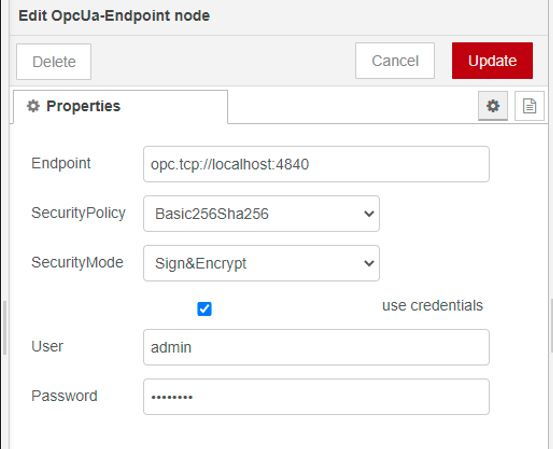
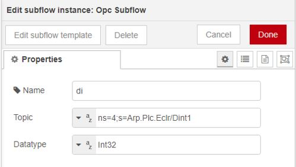

## Quick Reference Guide 
### For
## Phoenix Contact: EPC 1522 and EPC 1502
 
### Version: 1.2
---
# OPC UA to InfluxDB

There are two parts within this flow 

## Browse Data

This flow is used to browse the data/object structure under the Node ID provided.
This flow (Browse OpcUa - Fetch all the topics and datatypes from Server) is just used for reference of the second flow (Read OpcUa data from the server and insert into InfluxDB) and the output of this flow will give all the details from which topics and datatypes will be used in second flow.

  
SourceCode: [OPC UA to InfluxDB ](SourceCode/Quickstart_Flows/QuickGuideFlows/OpcUa_To_InfluxDB.json)

### Configure the OPC UA Endpoint

Click on pencil icon against OPCUA Browser/Client node 

  

Fill details of the OPCUA server. These details can also by seeing the properties of discovered server under OPCUA Client. Enter the Endpoint, Select Security Policy Security Mode and use credentials checkbox. Enter user and password of the device and click Update. The Endpoint will be updated and same can be used in both browser and client nodes of OPCUA.  

  

### Read OPC UA Data and insert into database

This flow is used for reading the data of given topic and datatype. Topics and datatypes will be taken from the output of Browse OpcUa flow or OPCUA Client.

  

OPC Subflow node will display in left panel once the flow is imported. 

  

Edit the Subflow node by entering the TOPIC and DATATYPE from output of previous flow (Browse OpcUa). Inside the Subflow function is written to fetch the data from the server and send it to node and these details can be seen by clicking on Edit Subflow Template. Similarly, multiple sub flows can be added to read the additional topics with corresponding datatype.

  

First Join node used directly after Opus Client node is used to join the output in key value pair. Then a function node is used to exclude extra data and create JSON objects using topic, datatype, and values. Again, a join node is used to join the multiple output into one as an array.
Finally, a function node is used to prepare the data for batch inserting it into InfluxDB, output is injected to InfluxDB batch node.

[OPC UA to InfluxDB ](SourceCode/Quickstart_Flows/OPCUA/OpcUaToInflux.json)