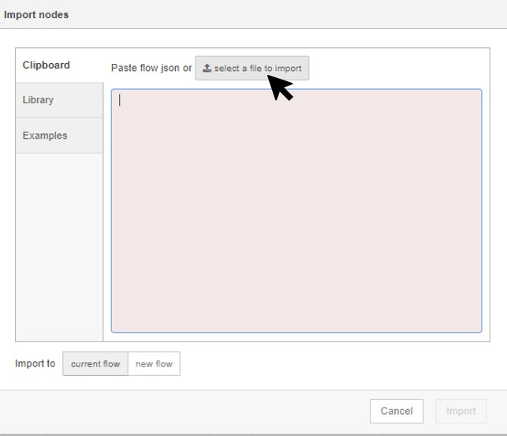

# Edge PC EPC 1502/1522 Quickstart Guide

The Edge PC repository is a collection of various sample code for Node-RED for Edge PC:

1185416 – EPC 1502 

1185423 -  EPC 1522 

Each example explains one or more topics on how to use Nodes and Function in the pre-installed Node-RED.

## Getting Started

1. Download this repository
2. Remove the .git folder
3. Adapt the files to your project
    *  Replace the README.md with your own, the [README_template.md](README_template.md) provides a template for all necessary content.
    *  Modify the [LICENSE](LICENSE). The recommended license is MIT.
    *  Name at least two maintainers in the [MAINTAINERS.md](MAINTAINERS.md).
    *  Tell developers whether its possible to contribute to your project and how to do it in the [CONTRIBUTING.md](CONTRIBUTING.md).
    *  Check the [CodeOfConduct.md](CodeOfConduct.md) for updates.
    *  The [SECURITY.md](SECURITY.md) is nessessary in every project, but there is no need to modify it.
4. Initialize a new local repository or add the changes to your project repository

Ask via [mail](mailto:OSSPLCnext@phoenixcontact.com) for an organisation repository and you will get further information.
If your project meets all criteria and is validated to be an organizational repository, you are responsible for maintenance. 
If the project is outdated, we reserve the right to remove it.

## Quickstart-Guide

|   #  |  Topic   |  Content   |  SourceCode   |
| --- | --- | --- | --- |
| 0 | [Example Project](00_FirstProjectExample.md) | This Example Project will show you, how to use all software within the EPC 1502/1522, to import OPC UA variables from PLCnext Engineer to Node-RED, to manage them in InfluxDB. | [PLCnext Engineer Variables to Node-RED & InfluxDB](SourceCode/Quickstart_Flows/OPCUA/OpcUaToInflux.json) |
|   1  |  [Basic Flows](01_BasicFlow.md)   |  Learn Node-RED within the Edge PC with basic node functions. Common and function nodes like "Inject","Debug","Switch" nodes are described.    | [Common & Function Nodes](SourceCode/Quickstart_Flows/BasicNodes/Common_Function_Nodes.json)   [Sequence Parser Nodes](SourceCode/Quickstart_Flows/BasicNodes/Sequence_Parser_Nodes.json)   [Storage Nodes](SourceCode/Quickstart_Flows/BasicNodes/Storage_Nodes.json)|
|  2   | [Modbus to InfluxDB](02_ModbusToInfluxDB.md)    | Configure Modbus Serial flows to take values form Modbus Slaves and insert those values into InfluxDB  | [Read data from Modbus Slave](SourceCode/Quickstart_Flows/QuickGuideFlows/Modbus_To_InfluxDB.json)      |
|  3   |  [OPC UA to InfluxDB](03_OPCUA_to_Influx.md)   |  Configure OPC UA flows to take values within PLCnext Engineer (local) and insert those values into InfluxDB  |  [OPC UA to InfluxDB ](SourceCode/Quickstart_Flows/QuickGuideFlows/OpcUa_To_InfluxDB.json) |
|  4   |  [InfluxDB to Any Cloud](04_InfluxDB_to_Cloud.md)  | Injects in every 2 min interval, a function node is provided to trigger multiple InfluxDB measurements at once using node.send   | [InfluxDB to AnyCloud ](SourceCode/Quickstart_Flows/QuickGuideFlows/InfluxDB_To_Cloud.json) |
|  5   |  [Any Cloud to  Modbus Write](05_Cloud_to_ModbusSer)  |  Gathering data from any Cloud and sending them to an Modbus Serial Slave    |  [AnyCloud to Modbus](SourceCode/Quickstart_Flows/QuickGuideFlows/Cloud_to_Modbus.json)   |
|   6   |  [Cloud to OPC UA Write](06_Cloud_to_OPCUA.md)   |  Write data into OPCUA server from cloud (Azure/AWS/GCP)   |  [AnyCloud to OPC UA](SourceCode/Quickstart_Flows/QuickGuideFlows/Cloud_to_OPCUA.json)   |
|     |     |     |     |

## Import Example-flows into Node-RED of your EPC 1502/1522
1. 
 Connect to your Edge-PC via Ethernet and open the Edge-Cockpit.  
    Default: http://192.168.2.10/cockpit 

2. 
 Open Node-RED 

3. Click on the "Import" button on the right upper corner.  
 

4. Click on "select a file to import" and open up the example-flow you downloaded before.  
 

## Contributing

You can participate in this project by [submitting bugs and feature requests](https://github.com/PLCnext/OSSTemplate/issues). Help us by checking *this guide* how bugs are reported.
Please let us know if anything is not working out as expected.

## Feedback

* Ask a question in our [Forum](https://www.plcnext-community.net/index.php?option=com_easydiscuss&view=categories&Itemid=221&lang=en).
* Request a new feature on [GitHub](CONTRIBUTING.md).
* File a bug in [GitHub Issues](https://github.com/PLCnext/CSharpSamples/issues).

## License

Copyright (c) Phoenix Contact Gmbh & Co KG. All rights reserved.

Licensed under the [MIT](LICENSE) License.